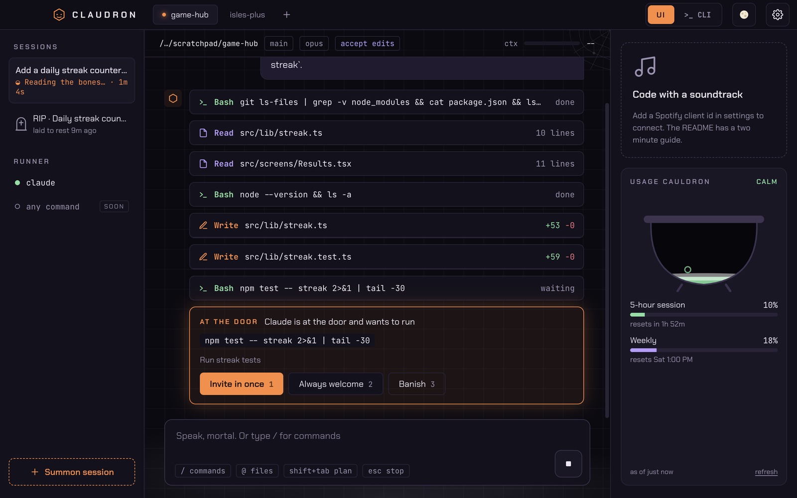
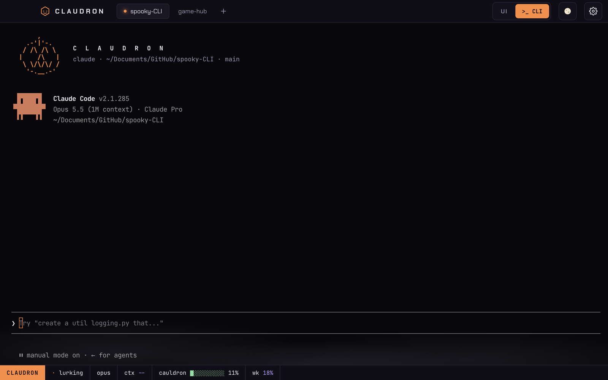
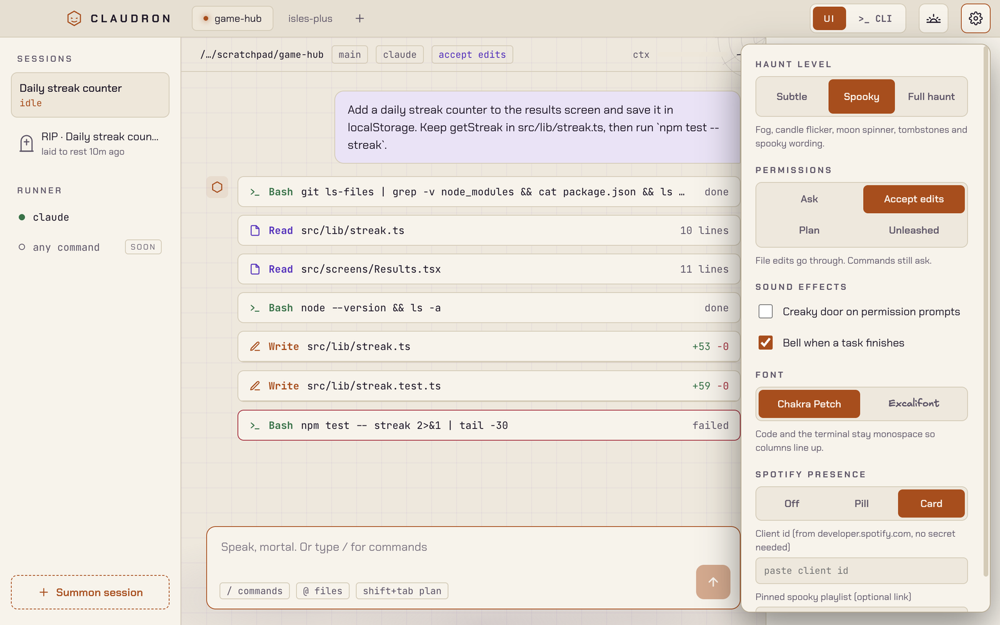

<p align="center">
  
</p>

<h1 align="center">Claudron</h1>

<p align="center">
  A haunted desktop shell for Claude Code. macOS and Windows.
</p>



Claudron wraps the real `claude` you already use. Flip between a proper chat UI with diffs and permission cards, and the plain terminal you know. Everything runs on your machine with your existing Claude login. There is no Claudron account and no Claudron server.

It is also a little bit spooky. You can turn that down.

The name is Claude plus cauldron, which is also where your usage limits bubble away.

## What you get

**Two ways to drive Claude.** UI mode talks to Claude Code through the Agent SDK, so tool calls show up as cards: reads, edits with real diffs, shell commands, todo lists. Permission prompts become a card you answer with `1`, `2` or `3`. CLI mode is the actual `claude` binary in a real terminal (node-pty + xterm.js), nothing simulated.

**Project tabs.** Open as many folders as you want. Each tab keeps its own session, and terminals keep their scrollback when you switch away.

**A usage cauldron.** The pot fills with your 5-hour plan usage and changes mood as it goes: calm, simmering, boiling, boiling over. Weekly usage sits under it. In CLI mode it lives in the status line as `cauldron ██████░░░░ 62%`. More on where the numbers come from [below](#where-the-usage-numbers-come-from).

**Spotify in the corner.** See what is playing, skip, pause, or summon a Halloween playlist. When Claude needs your permission the music dips to 30% so you notice, then comes back.

**Haunt level.** Subtle is plain wording and no animation, good for screen shares. Spooky adds fog, candle flicker, a moon phase spinner, tombstones for old sessions and a pumpkin at the top of the terminal. Full haunt adds bats, glitchy error lines and sound effects. Every animation stops if your OS asks for reduced motion.

| | |
| --- | --- |
|  |  |

## Install

Grab a build from [Releases](../../releases):

- **macOS:** `Claudron-x.y.z-mac-arm64.dmg` for Apple silicon, `-mac-x64.dmg` for Intel.
- **Windows:** `Claudron-x.y.z-win-x64-setup.exe`.

You need to be logged in to Claude Code once (`claude` then `/login`). Claudron uses the same credentials.

The builds are not code signed yet. On macOS, if Gatekeeper says the app is damaged, run `xattr -cr /Applications/Claudron.app` once. On Windows, SmartScreen will ask you to confirm.

### Build it yourself

```sh
git clone https://github.com/chrrisk/spooky-CLI.git
cd spooky-CLI
npm install
npm run dev
```

Node 22 or newer. `npm run dist:mac` or `npm run dist:win` packages for the platform you are on.

## Where the usage numbers come from

The cauldron only shows percentages Claude Code itself reports. It never estimates from token counts, never guesses your plan limits, and never fills in the gaps between readings. If there is no fresh number, it shows an empty, dashed pot that says **NO READING**.

Readings come from three places, and the newest one wins:

1. The Agent SDK's `rate_limit_event` messages during UI-mode sessions.
2. The SDK's `/usage` control request, asked every few minutes by a small idle `claude` process. This API is marked experimental in the SDK, so if a future version drops it the cauldron just leans on the other two.
3. The `rate_limits` block Claude Code passes to status line commands, in CLI mode.

A reading older than ten minutes counts as no reading. If you use an API key, Bedrock or Vertex there are no plan limits to show, and the cauldron says so.

## How CLI mode hooks in

Claudron starts `claude` with an extra `--settings` argument that adds:

- a status line command, which saves the JSON Claude Code hands it (model, context, rate limits)
- a few hooks (`UserPromptSubmit`, `Notification`, `PostToolUse`, `PermissionDenied`, `Stop`) so Claudron knows when Claude is working or waiting on you

Both run a tiny script, `resources/claudron-tap.cjs`, using Claudron's own Electron binary, so you do not need Node installed. If you already have a custom status line in `~/.claude/settings.json`, it still runs and its output goes through untouched. Nothing in your settings files is modified.

Changing the permission mode while a terminal is open restarts `claude` with `--continue`, so you land back in the same conversation.

## Spotify setup

Spotify needs an app registered to your account. It takes two minutes and there is no secret involved (Claudron uses PKCE).

1. Go to [developer.spotify.com/dashboard](https://developer.spotify.com/dashboard) and create an app.
2. Add this redirect URI exactly: `http://127.0.0.1:43117/callback`
3. Tick **Web API**, save, and copy the client id.
4. In Claudron, open settings (the gear), paste it under Spotify presence, then hit **Connect Spotify**.

Tokens are encrypted with your OS keychain through Electron's `safeStorage`. Play, pause, skip and volume need Spotify Premium; free accounts still get now playing. You can pin your own spooky playlist in settings, otherwise the button searches for one.

If you build Claudron for other people, set `MAIN_VITE_SPOTIFY_CLIENT_ID` at build time (see `.env.example`) so they can skip steps 1 to 3.

## Settings

| Setting | Options | Default |
| --- | --- | --- |
| Theme | dark, light | dark |
| Interface | UI, CLI | UI |
| Haunt level | subtle, spooky, full | spooky |
| Permissions | ask, accept edits, plan, unleashed | ask |
| Font | Chakra Petch, Excalifont | Chakra Petch |
| Sound effects | creaky door on prompts, bell on finish | follow haunt level |
| Spotify | off, pill, card | card |

**Unleashed** is `--dangerously-skip-permissions`. Claude runs anything without asking. Claudron warns you the first time and shows a red `UNLEASHED` badge for as long as it is on.

Shortcuts: `shift+tab` cycles ask, accept edits and plan in the composer. `esc` stops a running turn. `ctrl+space` plays or pauses music from inside the terminal.

## Development

```sh
npm run dev        # electron-vite with hot reload
npm test           # vitest
npm run typecheck
npm run icon       # re-render build/icon.png
```

Layout:

```
src/
  main/       Electron main: window, pty, Agent SDK sessions, usage, Spotify
  preload/    the typed IPC bridge, nothing else
  renderer/   React app
  shared/     types and pure logic used by both sides (diffs, copy, usage moods)
resources/    claudron-tap.cjs, run by Claude Code in CLI mode
docs/         design spec and the HTML mockups everything is built from
```

Every IPC channel is declared once in `src/shared/ipc.ts`. Main, preload and renderer are all typed from that file, and preload rejects any channel that is not in it.

A handy trick while working on the UI: `CLAUDRON_SNAPSHOT=shot.png npm run dev` saves a screenshot of the window after it settles and quits. `CLAUDRON_USER_DATA=/tmp/claudron` points it at a throwaway profile.

## Known rough edges

- Windows builds come out of CI but have had less hands-on use than macOS. CLI-mode hooks rely on Claude Code running hook commands through Git Bash, which is what it does on Windows today.
- The usage probe uses an SDK method that is explicitly marked experimental.
- UI mode does not render `AskUserQuestion` forms yet, so Claude asks those questions in plain text.
- The "any command" runner in the sidebar is a placeholder.

## License

MIT. Excalifont is by the Excalidraw team under the SIL Open Font License. Chakra Petch and JetBrains Mono are also OFL.

Claudron is an independent fan project. It is not made, endorsed or supported by Anthropic. Claude and Claude Code are trademarks of Anthropic.
